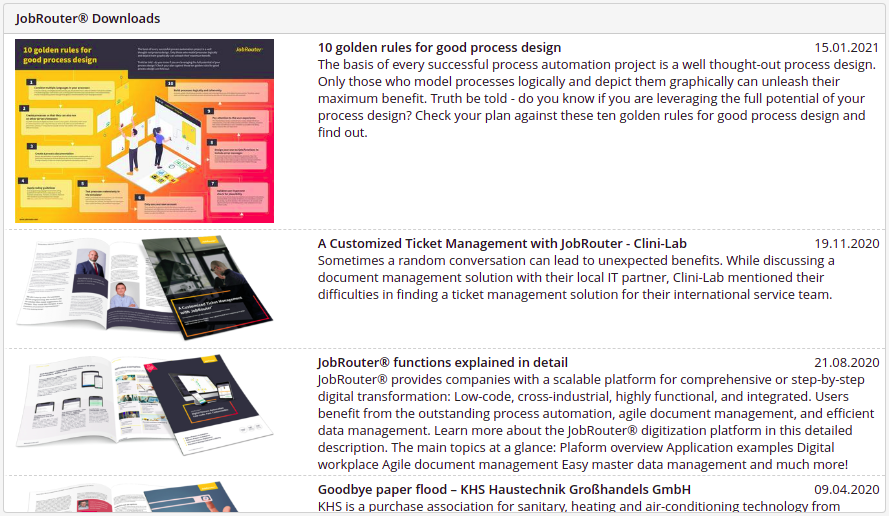

# JobRouter® Dashboard Widget "Downloads"

This dashboard widget for the [JobRouter® digitisation platform](https://www.jobrouter.com/) 
displays a list of the recent download papers from the according RSS feed on the
JobRouter website:

With a click you'll get to the JobRouter web page where you can request
the PDF file.

As the RSS feed is available in English and German the content of the dashboard widget
is also available in these two languages. If you chose German in your settings as
language you will see the German content, otherwise the English content.

## Installation

The widget supports JobRouter® version 4.3 and up.

Download the [latest release](https://github.com/brotkrueml/jobrouter-widget-downloads/releases).
Extract the ZIP package in the `dashboard` folder of your JobRouter® installation.

A connection to the internet must be available to retrieve the RSS feed and the images
from the JobRouter website.

## Caching

The content of the RSS feed is cached for one day. After that time it will be
retrieved again by the next call of the dashboard.

The images are collected once and cached in the folder `cache` in the widget
directory. The deletion of this folder is safe, the images are downloaded again
upon next retrieval of the RSS feed.
